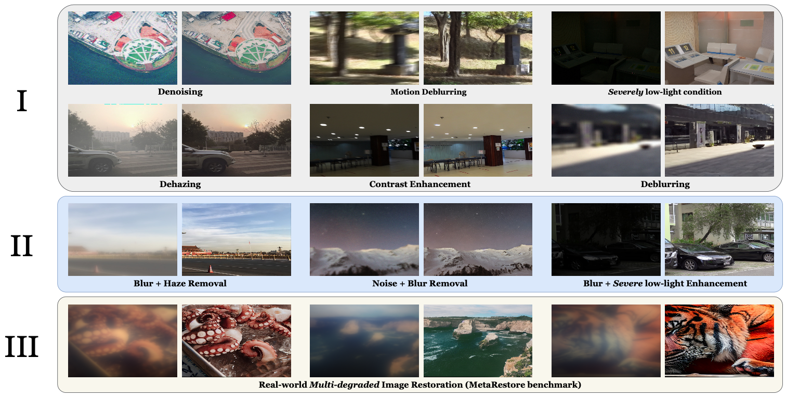

# UniCoRN: Latent Diffusion-based Unified Controllable Image Restoration Network across Multiple Degradations

**[Debabrata Mandal](https://debman.github.io), [Soumitri Chattopadhyay](https://soumitri2001.github.io), [Guansen Tong](https://g-tong.github.io), [Praneeth Chakravarthula](https://www.cs.unc.edu/~cpk/)**

University of North Carolina at Chapel Hill

[](https://arxiv.org/abs/2503.15868)
[](https://codejaeger.github.io/unicorn-gh)

---



> **UniCoRN** is a unified image restoration model that handles multiple simultaneous degradations — blur, haze, noise, and low-light — without requiring prior knowledge of the corruption type. Built on Stable Diffusion v1.5, it conditions a frozen diffusion backbone through a novel multi-head control network driven by cheap, task-agnostic low-level visual cues extracted directly from the degraded input.

---

## Highlights

- **Corruption-agnostic:** recovers images corrupted by unknown, co-existing degradations in a single forward pass.
- **Low-level cue guidance:** dark-channel transmission maps, shock-filtered edge maps, and color/gradient cues replace unreliable semantic prompts as control signals.
- **Multi-head control + MoE adapter:** separate per-degradation ControlNet heads, mixed at inference by a lightweight Mixture-of-Experts adapter conditioned on CLIP text embeddings.
- **Task Stabilizer Unit (TSU):** a shared residual block between encoder stages that stabilises gradient flow when switching tasks during curriculum training.
- **MetaRestore benchmark:** a new real-world dataset captured with a metalens camera exhibiting compound degradations.
- **3–5× faster** than diffusion-based restoration baselines at inference while matching or exceeding their quality.

---

## Results

### MetaRestore benchmark (zero-shot)


| Method | PSNR ↑ | SSIM ↑ | LPIPS ↓ | NIQE ↓ | BRISQUE ↓ |
|---|---|---|---|---|---|
| AirNet | 12.69 | 0.341 | 0.62 | 29.57 | 39.96 |
| PromptIR | 13.10 | 0.358 | 0.616 | 29.53 | 34.45 |
| AutoDIR | 12.65 | 0.255 | 0.654 | 22.45 | 61.29 |
| DiffUIR-L | 16.97 | 0.434 | 0.472 | 12.78 | 47.98 |
| DA-CLIP | 14.41 | 0.312 | 0.687 | 22.21 | 49.16 |
| **UniCoRN (ours)** | **27.93** | **0.436** | **0.554** | **5.27** | **31.66** |

### Mixed degradation datasets


| Method | Blur+Haze PSNR ↑ | SSIM ↑ | LPIPS ↓ | Noise+Blur PSNR ↑ | SSIM ↑ | LPIPS ↓ | Low+Blur PSNR ↑ | SSIM ↑ | LPIPS ↓ |
|---|---|---|---|---|---|---|---|---|---|
| AutoDIR | 12.97 | 0.394 | 0.577 | 17.97 | 0.475 | 0.443 | 18.32 | 0.662 | 0.304 |
| AirNet | 16.99 | 0.480 | 0.569 | 18.56 | 0.564 | 0.401 | 10.20 | 0.130 | 0.515 |
| PromptIR | 14.75 | 0.431 | 0.528 | 23.30 | 0.601 | 0.455 | 10.24 | 0.096 | 0.501 |
| DA-CLIP | 14.37 | 0.493 | 0.638 | 21.52 | 0.671 | 0.403 | 16.44 | 0.680 | 0.242 |
| **UniCoRN (ours)** | **28.83** | **0.673** | **0.212** | **28.55** | **0.717** | **0.162** | **28.47** | **0.777** | **0.149** |

### Single-degradation tasks


| Task | Dataset | PSNR ↑ | LPIPS ↓ |
|---|---|---|---|
| Dehazing | RESIDE | 29.90 | 0.174 |
| Motion Deblur | GoPro | 28.90 | 0.155 |
| Low-light Enhancement | LOL | 28.30 | 0.159 |
| Denoising | CBSD68 | 29.30 | 0.301 |

---

## Pretrained Models

Download checkpoints and place them in a local `ckpts/` directory.

| Checkpoint | Description | Download |
|---|---|---|
| `mixer_v2.ckpt` | Fine-tuned SD1.5 diffusion backbone (our base model) | coming soon |
| `unicorn_trained.ckpt` | Fully trained UniCoRN (zero-shot, all 4 tasks) | coming soon |
| `unicorn_metarestore.ckpt` | Fine-tuned on MetaRestore training split | coming soon |
| `vae-ft-mse-840000-ema-pruned.ckpt` | Fine-tuned VAE (Stability AI) | [HuggingFace](https://huggingface.co/stabilityai/sd-vae-ft-mse) |

`unicorn_init.ckpt` (the ControlNet scaffold before training) is derived locally from `mixer_v2.ckpt` — see [Initialising the checkpoint](#initialising-the-checkpoint) below.

---

## Installation

```bash
git clone https://github.com/debman/unicorn.git
cd unicorn
pip install -r requirements.txt
```

**Optional — GPU-accelerated cue extraction:** install CuPy matching your CUDA version for significantly faster datagen preprocessing:

```bash
pip install cupy-cuda12x   # CUDA 12.x
# pip install cupy-cuda11x # CUDA 11.x
```

Without CuPy the datagen falls back to CPU via scipy/ndimage automatically.

---

## Initialising the Checkpoint

The ControlNet weights are bootstrapped from the diffusion backbone's UNet before training. Run this once:

```bash
cd unicorn/
python init_weights.py /path/to/mixer_v2.ckpt /path/to/unicorn_init.ckpt
```

This copies `model.diffusion_*` weights from the SD1.5 backbone into the `control_model.control_*` keys of the multi-head ControlNet. Any keys without a matching source are randomly initialised and logged.

---

## Data Preparation

### Training datasets

UniCoRN trains on four degradation tasks with the following paired datasets:

| Task | Datasets |
|---|---|
| Defocus deblur | Defocus Blur Detection dataset (train split) |
| Haze removal | RESIDE SOTS-indoor, OTS, CDD-11 |
| Low-light enhancement | LOL, LOL-Blur |
| Denoising | DIV2K + additional noise pairs |

### Generating low-level cues

Before training, run the datagen script to extract per-image cues for each dataset. Edit `datagen/low_level_cues_gen.py` to populate `dataset_configs` with your local paths (see the example entry at the bottom of the script), then:

```bash
cd /path/to/unicorn/datagen
python low_level_cues_gen.py
```

The `hints/` subpackage (`refineblur_gpu`, `refinehaze_gpu`) must be importable from the datagen working directory. It lives alongside the datagen folder in the parent package.

For each input image the script writes a subdirectory of named cue PNGs:

```
output_dir/
  <rel_path>/<image_stem>/
    original.png
    Structure_Tensor_Coherence.png
    Bright_Channel_Prior.png
    Gabor_Energy.png
    Multi-scale_Gradient.png
    Laplacian_Residuals.png
    Local_Std_Deviation.png
    Saturation_Map.png
    Noise_Map.png
    Shock_Map_0.png        # Wiener-deconvolved blur estimate
    Shock_Map_1.png        # shock-filtered edge map
    Haze_Map_0.png         # dark-channel transmission estimate
    Color_Map_0.png        # normalised color map (Retinex-inspired)
    Color_Map_1.png        # gradient-edge map
    Target.png             # clean reference image
```

---

## Training

Set the dataset path variables near the top of `train.py` to your processed data roots, then:

```bash
cd unicorn/
python train.py \
  --ckpt /path/to/unicorn_init.ckpt \
  --config ./models/config.yaml \
  --lr 1e-5 \
  --bs 8 \
  --gpus 2 \
  --out_path ./output \
  --ckpt_out_path ./checkpoints
```

| Argument | Default | Description |
|---|---|---|
| `--ckpt` | required | Initialised UNICORN checkpoint |
| `--config` | `./models/config.yaml` | Model architecture config |
| `--lr` | `1e-5` | AdamW learning rate |
| `--bs` | `1` | Per-GPU batch size (effective batch = bs × gpus × 16 accum steps) |
| `--gpus` | `1` | Number of GPUs |
| `--out_path` | `./output` | Logging and metric output |
| `--ckpt_out_path` | `./checkpoints` | Checkpoint save directory |
| `--task_prompts` | *(none)* | Optional JSON task prompt bank |

Training uses bf16 mixed precision with gradient accumulation over 16 steps and DDP across all GPUs. The curriculum schedule trains single-task heads first before introducing multi-degradation combinations to prevent catastrophic forgetting.

---

## Architecture Overview


UniCoRN extends ControlNet with four components:

1. **Multi-Level Condition Network (MLCN):** multi-branch encoder that fuses a primary task-specific image estimate with cheap secondary cues (transmission map, edge map, color map) at multiple spatial scales using NAFBlocks.
2. **Shared Multi-Head Control Module:** `K` separate control paths — one per degradation type — all sharing a single frozen SD1.5 UNet backbone.
3. **Task Stabilizer Unit (TSU):** shared residual block inserted between every pair of control encoder layers that uses the average control signal to modulate gradients when switching tasks during curriculum training.
4. **Task-aware MoE Adapter:** separable convolutional layer that computes per-head mixture weights conditioned on CLIP text embeddings of task prompts, then injects the blended control signal into the frozen UNet at each resolution.

---

## MetaRestore Benchmark

MetaRestore is a real-world multi-degradation dataset captured with a metalens camera positioned one metre from an LCD display displaying images sequentially. The metalens optics introduce simultaneous blur, low contrast, and colour artefacts without any synthetic simulation.

- **Training split:** 800 Div2K images captured under controlled exposure, white balance, and contrast settings
- **Evaluation split:** 400 images from a held-out source set


---

## Citation

```bibtex
@article{mandal2025unicorn,
  title   = {UniCoRN: Latent Diffusion-based Unified Controllable Image Restoration Network across Multiple Degradations},
  author  = {Mandal, Debabrata and Chattopadhyay, Soumitri and Tong, Guansen and Chakravarthula, Praneeth},
  journal = {arXiv preprint arXiv:2503.15868},
  year    = {2025}
}
```

---

## Acknowledgements

This codebase builds on [ControlNet](https://github.com/lllyasviel/ControlNet), [Stable Diffusion](https://github.com/CompVis/stable-diffusion), [UniControl](https://github.com/salesforce/UniControl), and [DA-CLIP](https://github.com/jiangyitong/DA-CLIP). We thank the authors of these projects for their open-source contributions.
